# How to Practice TOEFL: A Simple Step-by-Step Guide

If you are preparing for the TOEFL, you may be wondering:

**How should I practice TOEFL effectively?**

Doing more questions is not always enough. A better approach is to build your vocabulary, practice each skill, review your mistakes, and then take complete practice tests.

With **DailyWordtoon**, you can follow a simple three-step approach:

**Learn → Practice → Test**

## 1. Start with TOEFL Vocabulary

Before spending hours doing TOEFL questions, build a strong vocabulary foundation.

DailyWordtoon's **TOEFL Vocabulary** section uses stories and comics to help you learn words in context.

Instead of simply memorizing:

> acquire = get

you see the word used in a meaningful situation.

For example, you can learn vocabulary through short campus and academic stories, making it easier to connect the word with a situation.

   <a href="https://dailywordtoon.com/vocabulary">
  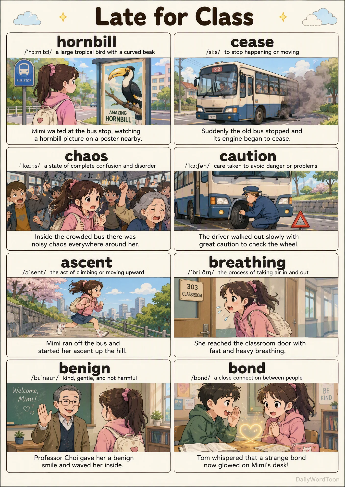
   </a>

DailyWordtoon also includes **Academic Word List (AWL)** vocabulary, which is useful for building the academic vocabulary needed for TOEFL reading and listening.

   <a href="https://dailywordtoon.com/awl">
  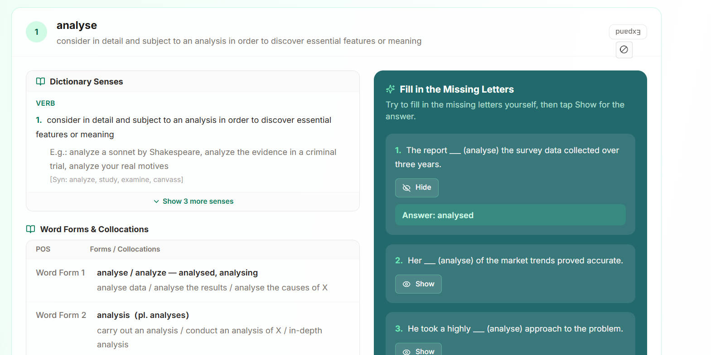
   </a>

### How to practice

Don't try to memorize hundreds of words in one sitting.

A better routine is:

**Learn a small set → review it → use it in practice → come back later.**

This makes vocabulary part of your daily TOEFL practice instead of a separate task.

---

# 2. Practice TOEFL Reading

Once you have built some vocabulary, start practicing individual TOEFL skills.

Go to **Practice → Reading** in DailyWordtoon.

  
   <a href="https://dailywordtoon.com/practice">
  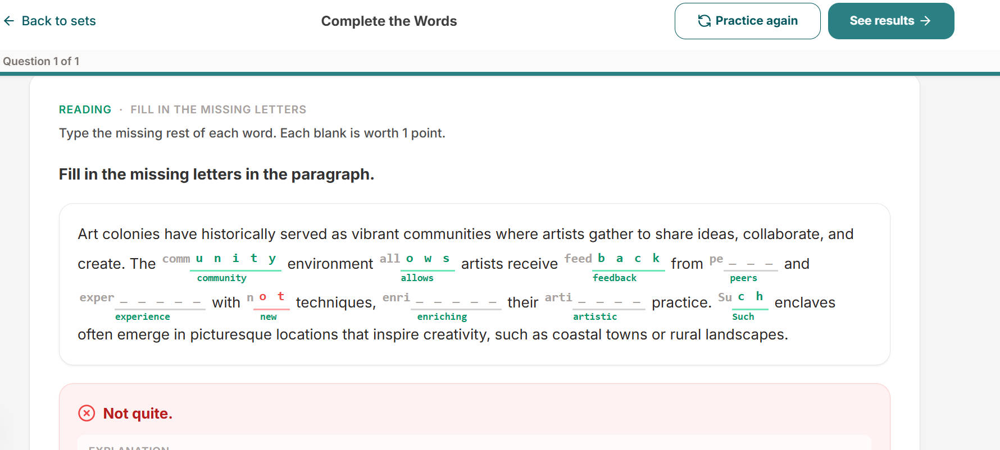
   </a>
   

   

  <a href="https://dailywordtoon.com/practice">
    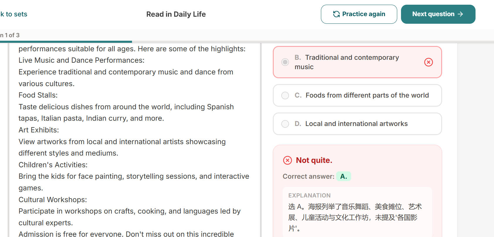
  </a>
      

      

  <a href="https://dailywordtoon.com/practice">
   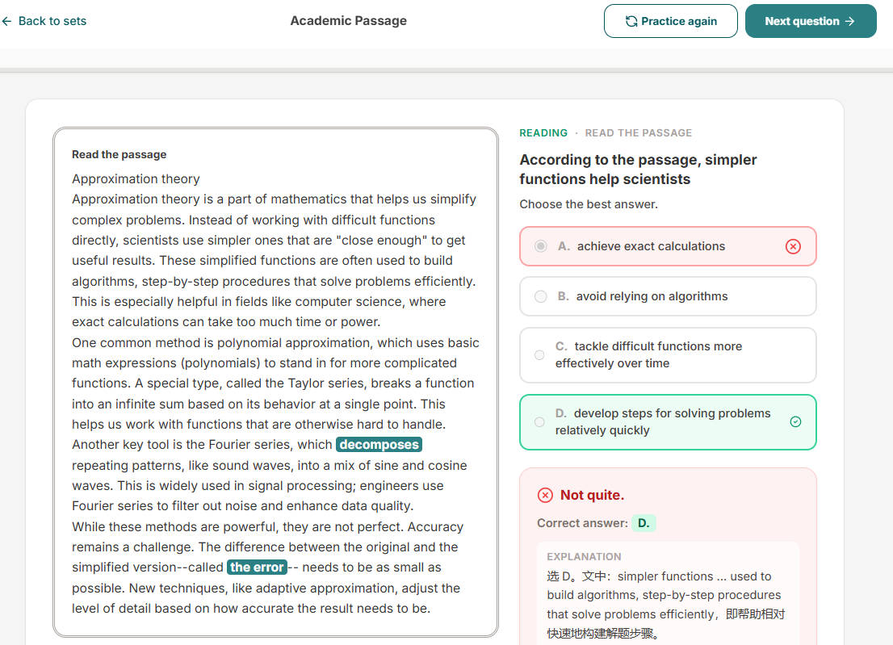
  </a>

Instead of immediately taking a complete test, start with a manageable practice set.

Read the passage, answer the questions, and submit your answers.

DailyWordtoon's Practice section is designed for short study sessions, so you can practice even when you only have 10–20 minutes.

### Review your answers

After completing a set, check your results and identify the questions you missed.

Don't just look at the correct answer.

Ask:

* Did I misunderstand the passage?
* Did I miss an important detail?
* Was the vocabulary unfamiliar?
* Did I choose an answer that sounded reasonable but wasn't supported by the passage?

This review is where much of the learning happens.

  
  <a href="https://dailywordtoon.com/practice">
  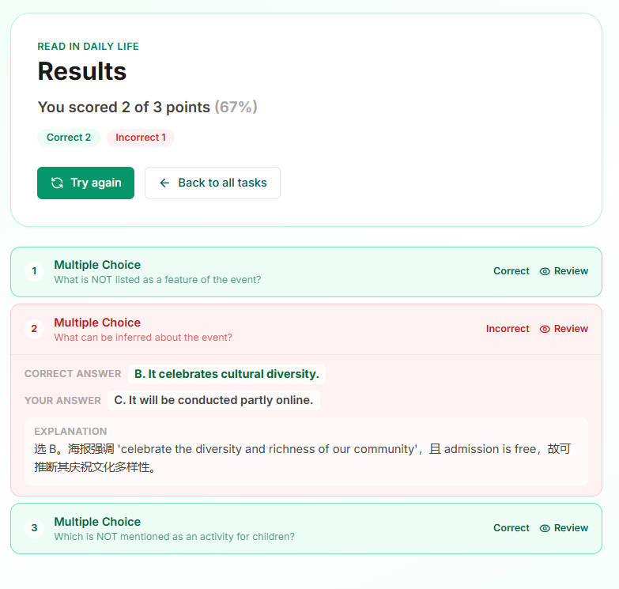   
  </a>

---

# 3. Practice TOEFL Listening

Next, practice listening.

Go to:

**Practice → Listening**

  
  <a href="https://dailywordtoon.com/practice">
  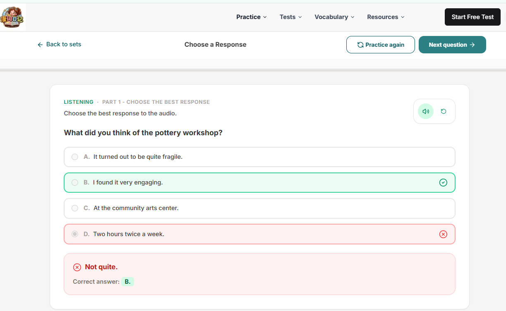   
  </a>

   <a href="https://dailywordtoon.com/practice">
  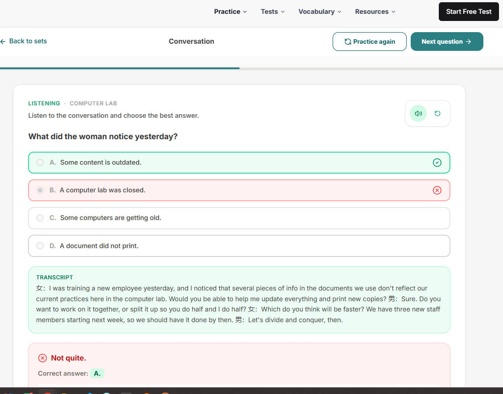   
  </a>

Listen carefully and answer the questions without looking at the transcript first.

After finishing the set, review your answers.

If you missed a question, listen to the relevant part again.

Then use the transcript to understand what you didn't catch the first time.

**Listen → Answer → Check → Replay → Review**

This is especially useful for students who can understand English when reading but have difficulty understanding it at normal speaking speed.

---

# 4. Practice TOEFL Writing

For Writing, don't only practice writing complete essays.

Start by becoming familiar with the different writing tasks and practice producing clear responses under time constraints.

Go to:

**Practice → Writing**

  
  <a href="https://dailywordtoon.com/practice">
  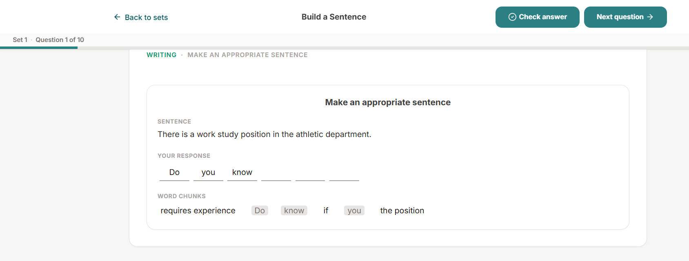   
  </a>

   <a href="https://dailywordtoon.com/practice">
  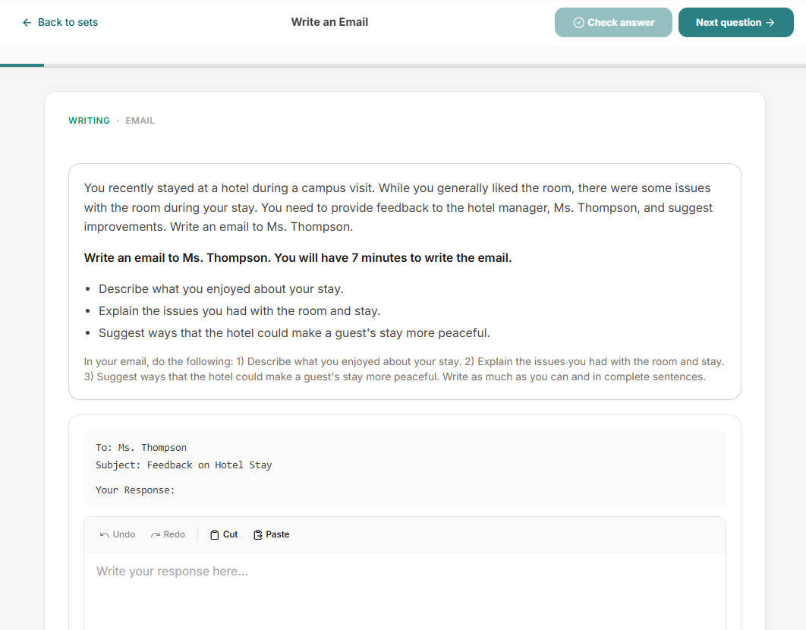   
  </a>

Focus on:

* Understanding the task
* Organizing your ideas
* Answering the question directly
* Using appropriate vocabulary
* Writing clearly and efficiently

After each practice session, review your response and identify one or two things to improve.

Don't try to fix everything at once.

---

# 5. Practice TOEFL Speaking

Speaking requires a different kind of practice because you need to produce English quickly.

Go to:

**Practice → Speaking**

  
  <a href="https://dailywordtoon.com/practice">
  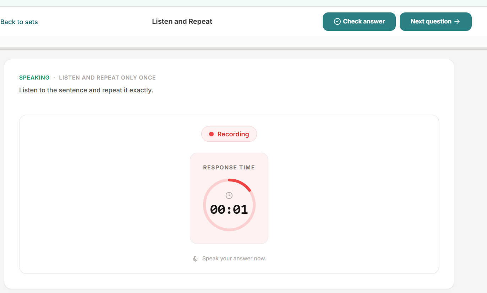   
  </a>

   <a href="https://dailywordtoon.com/practice">
  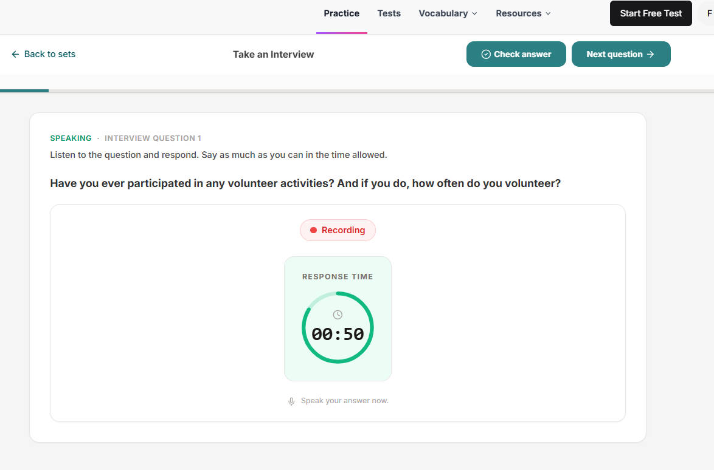   
  </a>

Practice answering within the available time rather than repeatedly preparing a perfect answer.

A useful routine is:

**Read/Listen → Think → Speak → Review → Try Again**

Pay attention to:

* Whether you answered the question
* Organization
* Fluency
* Vocabulary
* Grammar
* Pronunciation

The goal is to become comfortable producing English under time pressure.

---

# 6. Take Short Practice Sets Every Day

One reason students stop practicing TOEFL is that they think every study session needs to be long.

It doesn't.

With DailyWordtoon, you can complete a small practice set whenever you have some free time.

For example:

**Morning:** 10 minutes of vocabulary

**Lunch break:** one Reading or Listening set

**Evening:** Speaking or Writing practice

This makes TOEFL preparation easier to fit into a busy schedule.

You don't need to wait for a completely free afternoon.

**Small practice sessions add up.**

---

# 7. Take a 2026 TOEFL Practice Test

After practicing individual skills, take a complete **2026 TOEFL Practice Test**.

Go to:

**Practice Test**

**[Insert screenshot: DailyWordtoon Practice Test page]**

The purpose of a practice test is different from a normal practice set.

Practice helps you improve a specific skill.

A practice test helps you experience the complete testing process.

You can practice moving through the different sections, managing your time, and staying focused during a longer session.

**[Insert screenshot: Practice Test interface]**

Try to take the practice test under conditions similar to your actual exam.

Avoid checking answers while you are taking the test.

Finish the test first.

Then review your results.

---

# 8. Use Your Results to Decide What to Practice Next

A practice test shouldn't be the end of your preparation.

It should tell you what to do next.

For example, if your Reading performance is weaker than your other skills, return to:

**Practice → Reading**

If Listening is your main challenge, spend more time on:

**Practice → Listening**

If vocabulary is causing problems across multiple sections, return to:

**Learn → TOEFL Vocabulary**

This creates a simple cycle:

**Practice Test → Find Weaknesses → Focused Practice → Review → Practice Test**

---

# A Simple Daily TOEFL Practice Routine

You don't need a complicated study schedule.

You can start with something like this:

| Time           | DailyWordtoon Activity                   |
| -------------- | ---------------------------------------- |
| 10–15 min      | TOEFL Vocabulary / AWL                   |
| 10–20 min      | Reading or Listening Practice            |
| 10–20 min      | Writing or Speaking Practice             |
| Weekly         | 2026 TOEFL Practice Test                 |
| After the test | Review mistakes and adjust your practice |

The exact amount of time can change depending on your schedule and current level.

The important thing is to keep the cycle going.

# How to Practice TOEFL with DailyWordtoon

The overall process is simple:

### LEARN

Build your TOEFL vocabulary through stories, comics, and AWL vocabulary.

↓

### PRACTICE

Practice Reading, Listening, Writing, and Speaking with focused practice sets.

↓

### REVIEW

Check your answers, understand your mistakes, and practice again.

↓

### TEST

Take a 2026 TOEFL Practice Test to experience the complete test.

↓

### IMPROVE

Use your results to decide what to practice next.

**Learn → Practice → Review → Test → Improve**

That's a practical way to turn TOEFL preparation into a daily habit instead of waiting until the last few weeks before your exam.

